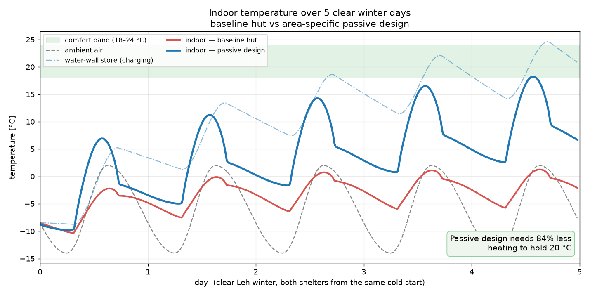

# Thermal-Shelter


**A software model that designs area-specific passive shelters — ones that stay warm
with little or no active heating** — built for **SIH 2026, Problem Statement 26051 (DRDO)**.

For cold, high-altitude regions like **Ladakh (Leh)**, it predicts how warm a shelter
stays from its climate, geometry and materials, so you can design one that captures and
holds the sun's heat instead of burning fuel to stay warm.



> **Result:** simulated over **5 clear Leh winter days from the same cold start**, an
> area-specific passive design (insulated envelope, 30 % south glazing, a 1000 L water
> wall) needs **~84 % less heating** than a baseline hut to hold 20 °C — climbing into the
> comfort band on sunlight alone, while the baseline hut tracks the freezing outdoor air.

---

## What it does

Given a region's **climate**, a shelter's **geometry**, and its **materials**, it predicts
exactly the three things the problem statement asks for:

1. **Indoor temperature over time** — hour by hour, including the brutal post-sunset drop
2. **Solar thermal energy captured** through the day
3. **Heat-flow breakdown vs ambient** — solar gain vs conduction / air-leakage / night-sky losses

…then lets you **compare designs** and search material, shape, size and orientation for the
**most thermally efficient** shelter — one that needs minimal (ideally zero) active heating.

## Why it's different

| | |
|---|---|
| **Transient, not static** | Models the full day–night cycle, so it captures the night-time drop that actually breaks comfort — not just an average. |
| **Night-sky radiative cooling** | The hidden loss most tools ignore. On a clear Leh night the air is −14 °C but the sky "sees" ≈ −45 °C — model it or you badly over-predict comfort. |
| **Thermal-mass battery** | Simulates stone, water walls and phase-change materials that soak up daytime sun and release it after dark. |
| **Fast enough to optimize** | Each design solves in **< 1 s** — sweep hundreds of options, then validate the winner in ANSYS. CFD takes hours per case. |

## Quickstart

```bash
git clone https://github.com/ritikx-36/sih-2026.git && cd sih-2026
python3 -m venv .venv                 # Python 3.12 recommended
.venv/bin/pip install --upgrade pip
.venv/bin/pip install -r requirements.txt
```

Run the demo — simulates a baseline hut vs a passive design and writes the chart above:

```bash
.venv/bin/python scripts/run_demo.py
```

An interactive dashboard (`streamlit run app.py`) — design a shelter live with sliders for
geometry, materials and orientation — is in progress.

## How it works

```
Climate  →  Solar engine  →  Thermal RC engine  →  Comfort + Energy  →  Compare / Optimize
(temp,      (irradiance      (indoor temp vs        (% time comfy,       (rank designs by
 sun,        on each wall,    time, incl. sky        kWh/day to           material / size /
 irradiance) roof, window)    radiation + mass)      hold 20 °C)          orientation / glazing)
```

A shelter is a box that **gains** heat (sun on the walls/roof and through the windows) and
**loses** heat (conduction through the envelope, cold air leaking in, and — crucially in
Ladakh — long-wave radiation to a very cold clear night sky). Heavy materials (stone,
concrete, water, PCM) act as **thermal mass**: they store daytime heat and release it slowly
after sunset, flattening the temperature swing.

The engine represents this as a **lumped RC network** — resistances for each heat-loss path,
capacitances for the thermal mass — and steps the indoor temperature forward in time, driven
by a **sol-air / sky-radiation** outdoor temperature. It's standard, defensible building
physics (RC thermal networks + the [pvlib](https://pvlib-python.readthedocs.io) solar model),
just packaged into a fast tool a non-specialist can drive.

## Project layout

```
thermalshelter/     core physics package
  materials.py      material thermal-property database          (done)
  climate.py        climate — Ladakh presets + user CSV         (done)
  solar.py          solar irradiance on each surface (pvlib)    (done)
  geometry.py       shelter geometry & envelope                 (done)
  engine.py         transient RC thermal model — the core       (done)
  comfort.py        comfort metrics                             (done)
app.py              Streamlit dashboard                         (in progress)
scripts/run_demo.py baseline-vs-passive demo → docs/demo_curve.png
docs/               figures used in this README
```

## Roadmap

| Stage | Status |
|---|---|
| Physics engine — climate, solar (pvlib), transient RC model, comfort metrics | **Done** |
| Demo — baseline vs passive over a multi-day Ladakh winter | **Done** |
| Interactive dashboard — design a shelter live | In progress |
| Design comparison + optimizer | Planned |
| ANSYS cross-validation & real Ladakh climate data | Planned |

## Tech stack

Python 3.12 · NumPy / SciPy · pandas · **pvlib** (solar) · **Streamlit** + Plotly (dashboard) · matplotlib

## References

- **pvlib-python** (Sandia National Labs) — solar position & clear-sky irradiance
- **Berdahl & Martin (1984)** — sky emissivity / long-wave radiative cooling
- **ASHRAE Handbook of Fundamentals** — sol-air temperature, RC networks, U-values & SHGC
- Passive-solar design — Trombe/water walls & thermal mass (Balcomb; U.S. DOE)

## License

Released under the MIT License.

---

*Built for Smart India Hackathon 2026 · Problem Statement 26051 · DRDO (Software).*
